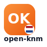

# Open KNM

<p align="center">
  
</p>


[](https://open-knm.org/discord)

**[中文]** | [English](#english)

---

## 🇨🇳 中文介绍

**Open KNM** 是一个开源、免费的荷兰融入考试备考指南。

**项目初心**：
> "从个人笔记到开源指南，陪你一起通过融入考试。"

这个项目最初只是我个人备考 **KNM (Kennis van de Nederlandse Maatschappij)** 时的私人笔记。随着内容的丰富，我决定将它开源，希望能帮助每一位像我一样在荷兰奋斗的新朋友，少走弯路，从容应考。

我们的目标很简单：为所有在荷兰生活的新移民、留学生和外籍人士提供一个清晰、准确且温暖的备考助手。不仅仅是为了通过考试，更是为了帮助大家真正读懂荷兰社会规则，让在这片土地上的生活更加从容。

### 核心特性

- **双语对照**：所有内容均提供中文与英文/荷兰文对照，降低语言门槛，适合初学者。
- **备考导向**：脱胎于真实备考经验，重点梳理 KNM 考试高频考点（历史、地理、法律、医疗等），拒绝冗余信息。
- **全面覆盖**：从 KNM 知识点到 A2 高频词汇，再到口语与写作模拟练习，覆盖融入考试主要科目。
- **社区驱动**：源于个人，成长于社区。欢迎任何人纠错、补充或分享你的备考心得。
- **现代技术**：基于 Next.js 16 和 Tailwind CSS v4 构建，极速、流畅、无广告。

### 快速开始

1. **克隆仓库**
   ```bash
   git clone https://github.com/xvllinihao/open-knm.git
   cd open-knm
   ```

2. **安装依赖**
   ```bash
   npm install
   ```

3. **启动开发服务器**
   ```bash
   npm run dev
   ```

4. 打开浏览器访问 `http://localhost:3000`。

### 参与贡献

我们非常欢迎任何形式的贡献！无论是修正错别字、翻译内容，还是分享你在荷兰生活的真实经验。
请阅读 [贡献指南 (CONTRIBUTING.md)](./CONTRIBUTING.md) 了解更多细节。

### 贡献者

感谢每一位通过 Issue、PR 或分享经验支持 Open KNM 的朋友！

[](https://github.com/xvllinihao/open-knm/graphs/contributors)

### 社区寄语

我们正在共同打造一个互助、透明、包容的学习社区。无论你是在荷兰生活多年的前辈，还是刚踏上旅程的新成员，你的经历与视角都很重要。请勇敢分享、积极提问、认真倾听，让更多人少走弯路、感受到支持。谢谢你成为这段旅程的一部分。🌱

---

<a id="english"></a>

## 🇬🇧 English Introduction

**Open KNM** is an open-source, free study guide for the Dutch civic integration exam.

**Origin Story**:
> "From personal notes to an open-source guide, accompanying you to pass the integration exam."

This project started as my private study notes for the **KNM (Kennis van de Nederlandse Maatschappij)** exam. As the content grew, I decided to open-source it. My hope is to help every newcomer striving in the Netherlands to avoid common pitfalls and face the exam with confidence.

Our goal is simple: to provide a clear, accurate, and welcoming study companion for all newcomers, students, and expats in the Netherlands. It's not just about passing the exam; it's about truly understanding Dutch society so you can live here with confidence.

### Key Features

- **Bilingual Support**: All content is available in Chinese and English/Dutch, lowering the language barrier for beginners.
- **Exam Focused**: Born from real exam experience. We focus on high-yield KNM topics (History, Geography, Law, Health, etc.) and cut out the fluff.
- **Comprehensive**: From KNM facts to A2 vocabulary, speaking, and writing practice—covering key parts of the integration exam.
- **Community Driven**: Started by one, grown by many. We welcome corrections, additions, and sharing of your own exam tips.
- **Modern Tech Stack**: Built with Next.js 16 and Tailwind CSS v4 for a fast, smooth, and ad-free experience.

### Getting Started

1. **Clone the repository**
   ```bash
   git clone https://github.com/xvllinihao/open-knm.git
   cd open-knm
   ```

2. **Install dependencies**
   ```bash
   npm install
   ```

3. **Start development server**
   ```bash
   npm run dev
   ```

4. Open `http://localhost:3000` in your browser.

### Contributing

We welcome contributions of any kind! Whether it's fixing typos, translating content, or sharing your real-life experiences in the Netherlands.
Please read our [Contribution Guide (CONTRIBUTING.md)](./CONTRIBUTING.md) for more details.

### Contributors

Big thanks to everyone who has supported Open KNM through issues, PRs, and shared knowledge!

[](https://github.com/xvllinihao/open-knm/graphs/contributors)

### Community Note

We are building a welcoming, transparent, and supportive learning space together. Whether you have lived in the Netherlands for years or just arrived, your stories and questions matter. Please keep sharing generously, asking openly, and listening with care so others can find clarity faster and feel less alone. Thank you for being part of this journey. 🌱

## License

MIT © [Open KNM Community](https://github.com/xvllinihao/open-knm)
